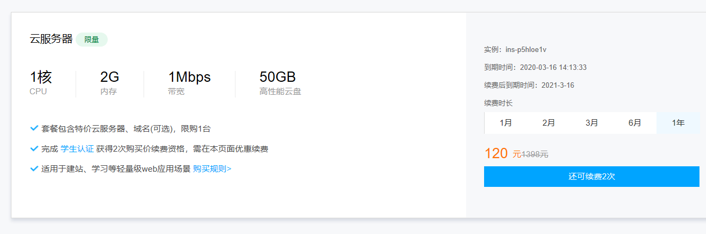

实验一    姓名 韦天钰 学号 116072017024

1.购买腾讯云服务

使用web shell登陆云服务器

安装x-shell登陆云服务器

2.创建github项目并在本地同步

注册github账号

在GitHub上创建云计算项目（CloudComputing）并在本地同步

（1）安装git

（2）验证是否存在ssh keys

​     ls -al ~/.ssh

（3）创建新的ssh key 

​     ssh-keygen -t rsa -b 4096 -C “764614473@qq.com”

（4）打开github账号的setting→ssh and gpg keys 复制黏贴生成的公钥id_rsa.pub

（5）ssh -T git@github.com测试是否配置成功

（6）git config --global user.name “nannan0625”配置用户名

（7）git config --global user.email “764614473@qq.com”配置邮箱

（8）创建一个代码仓库 进入一个文件夹cd /d/github  git init 初始化本地文件夹作为代码仓库

（9）拷贝项目网址

（10）git remote add origin `https://github.com/nannan0625/cloud-computing.git添加远程代码仓库的url

git remote -v验证

（11）从远程代码仓库拉取数据git pull origin master

（12）新建REAMDE文档

（13）添加文件夹中所有文件

git add .

（14）提交文件git commit -m “First commit”

（15）推送本地更新到远程服务器git push -u origin master

3本地安装VMware Workstation

安装centos

